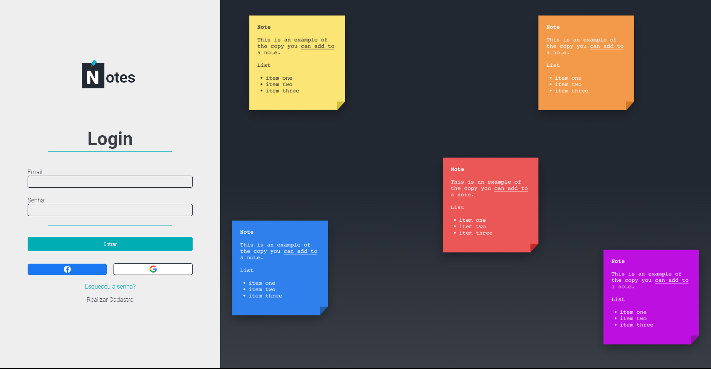
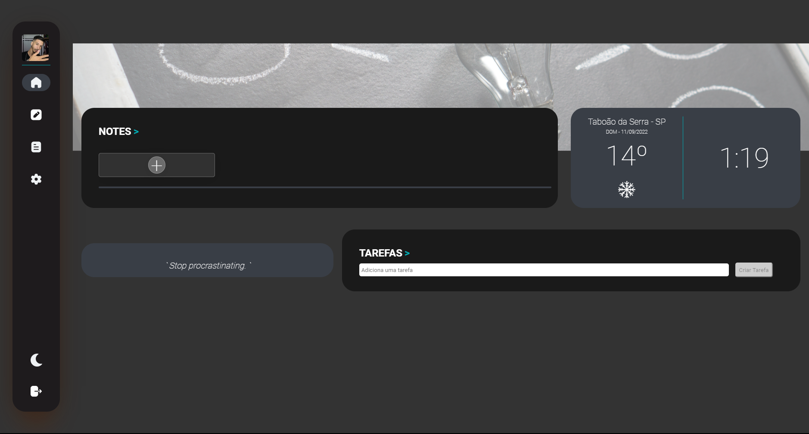

# Sejam Bem Vindos ao Projeto Notes -

Este projeto Visa colocar o meu recém adqurido conhecimento de Angular em prática (:

O projeto visa a criação de um aplicativo para anotações baseado no site - [Evernote](https://evernote.com/intl/pt-br).

## Tecnologias Utilizadas - 

1. Angular
2. Material.angular
4. Firebase;
## Tela De Login - 

  

Essa é a tela de login, onde o usuário poderá realiazar seu cadastro e logar com o Google ou Facebook.

## Tela Home - 

  

Esta é a Home do site, onde o usuário poderá realizar suas anotações, Adicionar Tarefas, Ter acesso a conselhos e Algumas informações sobre a temperatura, horário e data.

## APIS -

Para construir o projeto utilizei as seguintes API -
1. openWheater
2. Advice Slip
3. Firebase
